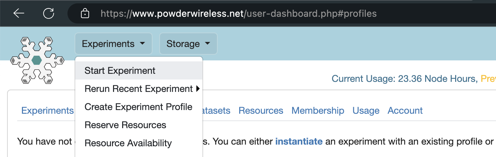
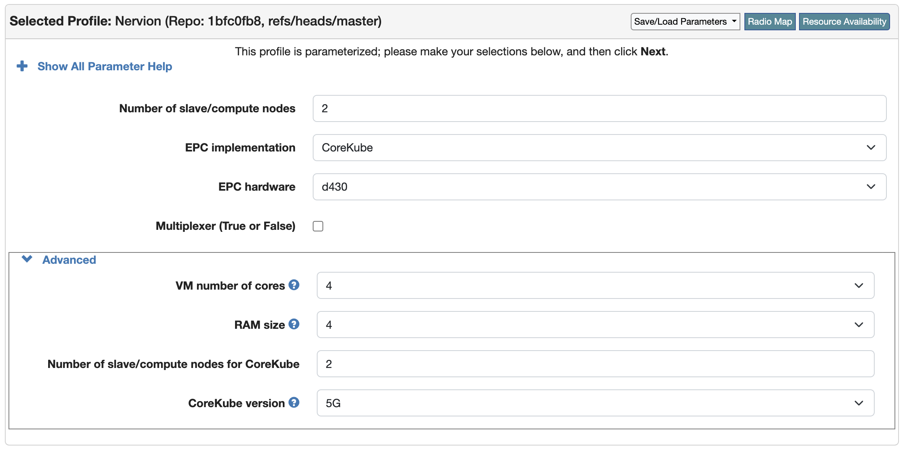
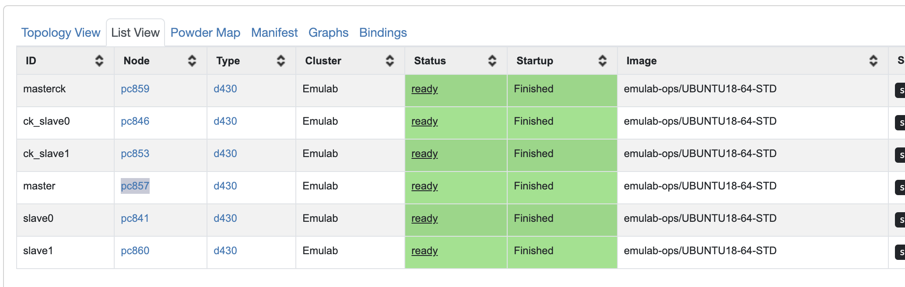
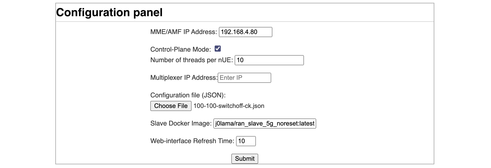
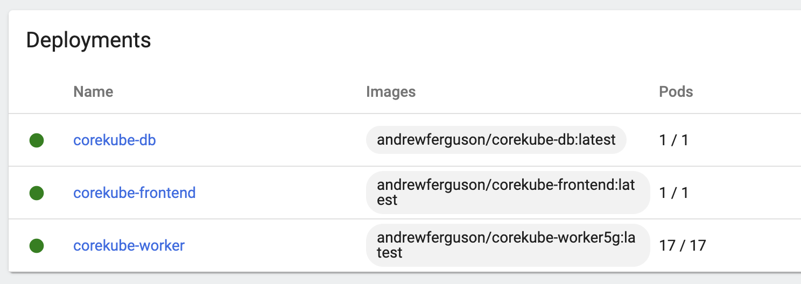
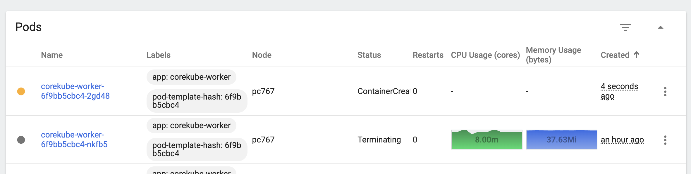

# Artifact Evaluation of CoreKube

In order to evaluate CoreKube as a core, we need an environment to emulate UEs and RANs that connect to it. We will use the [Nervion](https://github.com/netsys-edinburgh/nervion-powder) RAN emulator (Larrea, 2021). The official Nervion Powder Profile, available as a deployment profile within the [Powder Platform](https://powderwireless.net/), will deploy both Nervion and CoreKube on Powder.

## Creating an Experiment

Users need to set up a new CoreKube deployment on the Powder Platform. We assume that you have an account on the Powder Platform with your SSH public key attached.



1. First, [Log in](https://www.powderwireless.net/login.php) to the Powder Platform.
2. Click the top-left button "Experiments," and select from the dropdown "Start Experiment." You will be directed to a page to configure your new experiment.
3. Then, click the "Select Profile" button to open the dialogue to change the deployment profile from the default. Search for "Nervion", and select it.
4. Next choose configuration options for the deployment. Below are values each parameter should be set to.

    - **[Number of slave/compute nodes]** controls the number of VMs or physical nodes that will be part of the Kubernetes cluster for Nervion. Set this to **[2]**.
    - **[EPC implementation]** controls the mobile core network to deploy and test. Set this to **[CoreKube]**.
    - **[EPC hardware]** controls the hardware to run the mobile core network on. Set this to **[d430]** to run it on a physical hardware.
    - **[Multiplexer]** controls whether the dataplane multiplexer is enabled. The dataplane is not part of CoreKube, so we do not need this enabled. Set this to **[False]**.
    - **[VM number of cores]** controls the number of cores VMs will have if you have selected VM as the EPC hardware. We recommend keeping this at the default value.
    - **[RAM size]** controls the RAM VMs will have if you have selected VM as the EPC hardware. We recommend keeping this at the default value.
    - **[Number of slave/compute nodes for CoreKube]** controls the number of nodes that will be part of the Kubernetes cluster for CoreKube. Set this to **[2]**.
    - **[CoreKube Version]** controls which implementation of the CoreKube worker to use. Set this to **[5G]**.



5. Then give an optional name to the experiment. The node graph on the page should show 6 nodes: three for the Nervion cluster (`master`, `slave0`, and `slave1`) and three for the CoreKube cluster (`masterck`, `ck_slave0`, and `ck_slave1`).
6. Finalize the installation by clicking on "Finish" as there is no need to schedule the deployment.

The experiment is deployed and ready when, within the "List View" tab, all rows have a status of "ready" and say "Finished" for the "Startup" column. This can take 10-15 minutes.

When done, SSH into the `masterck` node (which acts as the CoreKube cluster controller). SSH connection details for each node are listed on the Powder experiment dashboard. You have two ways of following the evaluation workflow: through a graphical dashboard (GUI) or through the command line (CLI - advanced).

<table>
<tr>
<th>GUI</th>
<td>

Upon SSH-ing, you will be greeted with a web URL to the CoreKube Kubernetes dashboard, which provides a graphical overview of the CoreKube deployment. Navigate to that URL in your web browser. You will be prompted to log in, which you can bypass and use the admin account by pressing on the "Skip" button.

Once logged into the CoreKube Kubernetes dashboard, scroll down to the "Pods" section to see the list of running pods.

</td>
</tr>
<tr>
<th>CLI</th>
<td>

After SSH-ing, execute the following:
```
user@masterck:~$ kubectl get pods
NAME                                 READY   STATUS    RESTARTS   AGE
corekube-db-85b854b574-69zlv         1/1     Running   0          107s
corekube-frontend-6884d7f88f-r8tkq   1/1     Running   0          107s
corekube-worker-57456fcfcb-kjpxf     1/1     Running   0          107s
corekube-worker-57456fcfcb-ps5nw     1/1     Running   0          106s
```

</td>
</tr>
</table>

Verify that there are four pods with a status of "Running": one database instance, one front-end instance, and two worker instances. If any of them still have a status of "ContainerCreating", you should wait and check again.

## Experiment Workflow

To evaluate CoreKube's capabilities, you will need to subject it to a control plane workload. This will be done using the Nervion emulator included as part of the deployment. We outline here the common workflow across all experiments.

> :memo: **Note**
> 
> There may be different setup requirements for each that are detailed within their respective sections, so you are encouraged to read those first.


1. First, determine the hostname of the master node for the Nervion Kubernetes cluster. This is the node with the ID "`master`" in the Powder UI. The hostname will be the part after the at-mark (@) in the SSH command, in the format `pcXXX.emulab.net`, where XXX are digits.
2. Then, in a new tab in your web browser, navigate to the following URL: `http://<hostname>:34567`. This is the Nervion emulator's web interface, where you will configure the load for CoreKube.
3. Configure Nervion according to the values listed below for each parameter. The meaning of each parameter is documented in more detail in the [Nervion emulator documentation](https://github.com/netsys-edinburgh/nervion-powder/blob/master/doc/powder.md).

    - **[MME/AMF IP Address]** is the IP address of the MME/AMF. This is equivalent to the core network's IP. The deployment profile we used will automatically assign `192.168.4.80` to the core network, so set this to **[192.168.4.80]**.
    - **[Control-Plane Mode]** provides better scalability by disabling the data-plane. If this mode is enabled, each UE Kubernetes pod will emulate multiple UEs via multi-threading, instead of just one. **[Tick]** this as we do not need a data-plane, and set the **[Number of threads per nUE]** to **[10]**.
    - **[Multiplexer IP Address]** is the IP address of the multiplexer. Since we are not using one, leave this empty.
    - **[Configuration file]** is a JSON file that specifies the behavior that the UEs and the RAN should take in the emulation. For reference, a complete guide on the JSON format is [provided in the Nervion repository](https://github.com/netsys-edinburgh/nervion-powder/blob/master/doc/scenarios.md). 

    For this field, the autoscaling and resilience experiments use the **[100-100-switchoff-ck.json](./100-100-switchoff-ck.json)** file, while the efficiency (in terms of user-perceived control plane latency) experiment uses the **[single-ue-ck.json](./single-ue-ck.json)** file.
    - **[Slave Docker Image]** is the tag for the Docker image to use as the Nervion emulation slaves. Set this to **[j0lama/ran_slave_5g_noreset:latest]**.
    - **[Web-interface Refresh Time]** controls how often the web interface refreshes in seconds. It is fine to leave this at the default value.



4. Finally, press "Submit" to start the simulation.

## Evaluating CoreKube's Efficiency

As shown in Section 5.2 of the CoreKube paper, the efficiency of CoreKube is comparatively better than the alternatives from prior art. We measure the performance as the message response latency: the time taken by CoreKube to respond to a control plane message with a reply, measured from the time at which the incoming control plane message is received.

The Nervion emulator should be set up using the `single-ue-ck.json` file. This file specifies a single UE that attaches and detaches, with a ten-second wait between each attach-detach cycle. If a previous experiment is still running, click on the "Restart" button and wait 1-2 minutes for the pods to terminate before setting it up again.

To observe the results from this experiment, connect to the `masterck` node over SSH. SSH connection details for each node are listed on the Powder experiment dashboard. Then run the following script, stopping it with <kbd>Control</kbd> + <kbd>C</kbd> once you have enough output:

```
user@masterck:~$ /local/repository/config/test/latencies.sh
```

This script uses [`tshark`](https://www.wireshark.org/docs/man-pages/tshark.html) to capture the packets between Nervion and CoreKube. It is configured to only show NGAP (control plane) packets, and to show the relative times of such packets. Specifically, the first column of each line of output is the time between the previously-displayed packet and the current packet, measured in seconds.

Observe the rows that show packets from CoreKube to Nervion. The relative times of these packets represent the response latencies of CoreKube. The value should be within 1-3 milliseconds (0.001 - 0.003 seconds), which matches with values presented in Figure 6a of the CoreKube paper, and is better than latencies for Open5GS and Free5GS cores that go up to 10 milliseconds (0.01 seconds).

An example output is shown below. The latency of the *Authentication request* message can be observed by finding the line with the text "Authentication request", then observing the number at the start of the line. In this example case, it is 0.001833610, or 1.83ms. Similarly, the example output shows the latency of the *Security mode command* message to be 1.3ms.

```
2.000794704 Nervion → CoreKube NGAP 156 InitialUEMessage, Registration request
0.001833610 CoreKube → Nervion NGAP 148, DownlinkNASTransport, Authentication request
0.000673420 Nervion → CoreKube NGAP 152, UplinkNASTransport, Authentication response
0.001328286 CoreKube → Nervion NGAP 128, DownlinkNASTransport, Security mode command
```

## Evaluating CoreKube's Autoscaling

CoreKube auto-scales in response to its load, and distributes the incoming messages fairly across its workers (as detailed in Sections 3.4 and 5.3 of the CoreKube paper). This can be verified by examining how many worker nodes Kubernetes spins up when we subject it to a load to connect 100 UEs.

The Nervion emulator should be set up using the `100-100-switchoff-ck.json` file. This file specifies that there should be 100 UEs each connected to their own gNB (100 of them), performing a continuous loop of attaching and detaching (with switch-off). If a previous experiment is still running, click on the "Restart" button and wait 1-2 minutes for the pods to terminate before setting it up again.

<table>
<tr>
<th>GUI</th>
<td>

Open the CoreKube Kubernetes dashboard, with the experiment running. If needed, you can obtain the URL once again by SSH-into the master node of the CoreKube cluster (`masterck`).

In the table titled "Deployments," you should see the number of pods for `corekube-worker` gradually increase over the next few minutes. An example screenshot is given below:



</td>
</tr>
<tr>
<th>CLI</th>
<td>

SSH into `masterck` (master node for the CoreKube cluster) and execute `kubectl get pods`.

```
user@masterck:~$ kubectl get pods
NAME                                 READY   STATUS             RESTARTS   AGE
corekube-db-85b854b574-r66qz         1/1     Running            0          89m
corekube-frontend-6884d7f88f-nr4zs   1/1     Running            0          89m
corekube-worker-5845b465f4-2l428     1/1     Running            0          36m
corekube-worker-5845b465f4-8hj66     1/1     Running            0          28m
corekube-worker-5845b465f4-bxl92     1/1     Running            0          28m
corekube-worker-5845b465f4-n9lhj     1/1     Running            0          5m56s
corekube-worker-5845b465f4-pvgs6     1/1     Running            0          5m56s
...
```

The exact number of workers that CoreKube has spun up can be found with the following command:

```
user@masterck:~$ kubectl get pods --no-headers | wc -l | xargs bash -c 'echo $(($0 - 2)) workers'
16 workers
```

</td>
</tr>
</table>

Recall that we started the experiment with two workers, but now there are more instances for it, demonstrating that CoreKube has scaled dynamically to meet the demands of the load.

Note that the Kubernetes horizontal pod autoscaler (HPA) can take up to a minute to detect changes in load, which leads to the slight delay in scaling.

You can optionally customize the experiment through modifying the Nervion JSON configuration to have more or less UEs, and observe the change in number of pods CoreKube scales to. The [Nervion documentation](https://github.com/netsys-edinburgh/nervion-powder/blob/master/doc/powder.md) is a useful resource to guide the customization of UE behavior and load.

## Verifying CoreKube's Resilience

CoreKube is resilient to sudden outages or critical errors in its workers. This resilience feature shown in Section 5.4 of the CoreKube paper will be verified in this experiment. This will be done by deleting one random worker instance mid-load and verifying that a replacement will spin up.

Nervion emulator should be kept running after the auto-scaling experiment. If it was restarted, you should set up the Nervion emulator once again using the 100-100-switchoff-ck.json file.


<table>
<tr>
<th>GUI</th>
<td>

Open the CoreKube Kubernetes dashboard, with the experiment running. If needed, you can obtain the URL once again by SSH-into the master node of the CoreKube cluster (`masterck`).

In the table titled "Pods," choose any random worker pod and delete it to simulate a sudden critical failure. This can be done using the three-circle button on the right end of each row.

You should see live updates in the table. The worker that you selected to delete will change its status to "Terminating". After a few seconds, the HPA will detect an unusually high workload spread across the instances, and will spin up a new worker. You will be able to see this live as an additional row in the table, identified by a very recent creation time.



</td>
</tr>
<tr>
<th>CLI</th>
<td>

SSH into `masterck` (master node for the CoreKube cluster) and execute `kubectl get pods`. Choose any random one worker instance, and copy its name. Then execute the following to delete that instance:

```
kubectl delete pod <instance-name>
```

This is simulating the instance encountering a critical error and crashing.

If you execute `kubectl get pods` afterwards, you will notice one less worker instance as expected. However, after a few seconds, the HPA will detect an unusually high workload spread across the instances, and will spin up a new worker. This can be checked by running `kubectl get pods` again, and finding a worker with a fresh age (50s, in the example below).

```
user@masterck:~$ kubectl delete pod corekube-worker-5845b465f4-pvgs6
pod "corekube-worker-5845b465f4-pvgs6" deleted
user@masterck:~$ kubectl get pods
NAME                                 READY   STATUS             RESTARTS   AGE
corekube-db-85b854b574-r66qz         1/1     Running            0          4h16m
corekube-worker-5845b465f4-8hj66     1/1     Running            0          3h15m
corekube-worker-5845b465f4-bxl92     1/1     Running            0          3h15m
corekube-worker-5845b465f4-zfnvj     1/1     Running            0          50s
...
```

</td>
</tr>
</table>

This behaviour demonstrates CoreKube's ability to self-heal and prevent outages in the occasion of a random critical error. This is thanks to all workers being stateless, which means they can redirect the messages that would've been previously routed to the deleted instance. During the process of the one faulty pod terminating and a new one spinning up, all messages from the 100 UEs continue to be handled by being redirected to the other functioning workers.
